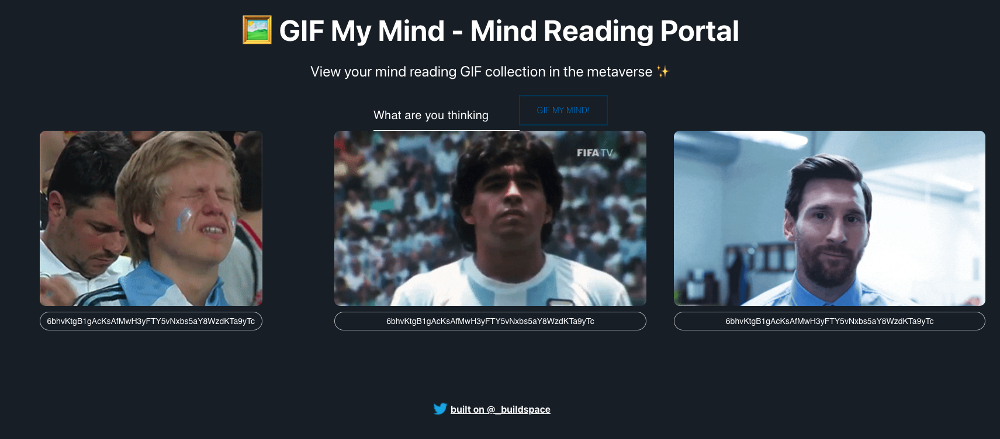

# buildspace Web3 app on Solana with React and Rust

This is a very nice and cool async, weeklong project for curious devs that want to hack around with Solana. You'll pick up some Rust, write + deploy a Solana program, and connect it all back to a React web3 app that anyone with a Solana wallet will be able to interact with!

> Powered by _buildspace
> [project link](https://zip.sc/WMngw)

## Built With

- React.js
- HTML5/CSS3, Javascript ES6
- VSCode

## Features
- [anchor_lang](https://github.com/project-serum/anchor) - Ethereum development environment for professionals
## Live Demo @Netlify

[Live Demo Link](https://anriquez-gif-mind-reader.netlify.app/)

## Getting Started

This project was bootstrapped with [Create React App](https://github.com/facebook/create-react-app).

To get a local copy up and running follow these simple example steps.

### Prerequisites

- To install the app in your system, make sure you have node/npm installed. [get npm](https://www.npmjs.com/get-npm)

### Setup

- Clone the repository in your system by using:

`git clone `

## Install

- Next step is to CD into the local repository and run:

`npm install`

### start development mode in your local environment

`npm start`

Runs the app in the development mode. 
Open [http://localhost:3000](http://localhost:3000) to view it in the browser.

The page will reload if you make edits. 
You will also see any lint errors in the console.

### `npm build`

This command builds the app for production to the `build` folder. 
It correctly bundles React in production mode and optimizes the build for the best performance.

The build is minified and the filenames include the hashes. 
Your app is ready to be deployed!

See the section about [deployment](https://facebook.github.io/create-react-app/docs/deployment) for more information.

## Authors

👤 **_Carlos Anriquez_**

- Github: [@canriquez](https://github.com/canriquez)
- Twitter: [@cranriquez](https://twitter.com/cranriquez)
- Linkedin: [linkedin](https://www.linkedin.com/in/carlosanriquez/)

## Show your support

Give a ⭐️ if you like this project!

## 📝 License
